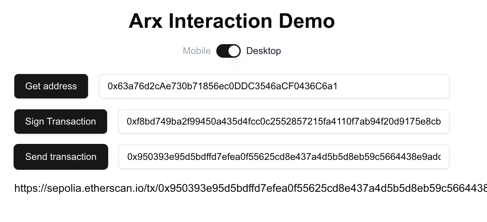

# Arx Transaction Next.js Demo



## Overview

This is a minimal example of signing and broadcasting a transaction with an Arx chip, using their [libhalo](https://github.com/arx-research/libhalo) library.  I tried to focus on functions that would be simple to pull out and use, so there's a lot of duplicate code, as well as an unfortunate number of state variables.  Example code is provided for signing transactions directly on mobile, as well as signing on desktop (via QR code).  Note that the steps (Get Address, Sign Transaction, Send Transaction) must be completed in order - the wallet address is needed to programmatically get the nonce, which is needed to create the transaction.
  
- **Desktop**:
- `desktopArxGetAddress`: Retrieve Arx address on desktop.
- `desktopArxSignTx`: Sign transaction on desktop.
- **Mobile**:
- `mobileArxGetAddress`: Retrieve Arx address on mobile.
- `mobileArxSignTx`: Sign transaction on mobile.

## Getting Started

To run the demo locally, follow these steps:

1. **Clone the Repository**


2. **Navigate to the Project Directory**


3. **Install Dependencies**

   ```bash
   npm install
   ```

4. **Create a .env file with the following (or hardcode an RPC url in page.tsx)**

   ```bash
   NEXT_PUBLIC_RPCURL=<your-sepolia-rpc-url>
   ```

5. **Run the Development Server**

   ```bash
   npm run dev
   ```

6. **Open in Browser**

   Visit [http://localhost:3000](http://localhost:3000) to view the demo.

## License

This project is licensed under the [MIT License](LICENSE).